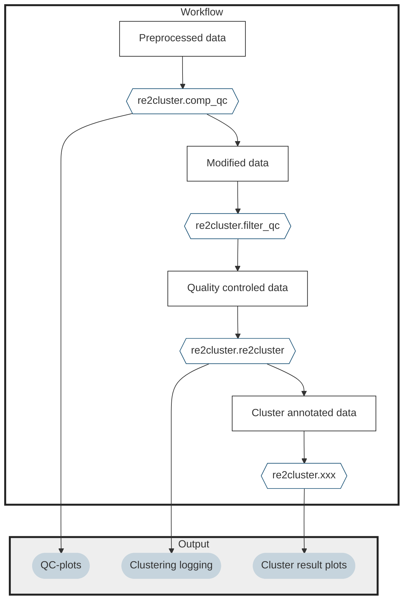

# re2cluster
Repetitive unsupervised clustering with optimal parameters by optimizing silhouette score. Based on ARBOLpy package.


Reimplementation of [ARBOLpy](https://github.com/jo-m-lab/ARBOLpy.git) package by K. Kimler with reduced functionality (see also original R implementation [ARBOL](https://github.com/jo-m-lab/ARBOL.git))

## Workflow 




## Installation 

Install from github, ideally in conda environment 
``` 
# conda create -n re2cluster python=3.9 ; conda activate re2cluster
pip install git+https://github.com/lucas-diedrich/re2cluster.git

# Test import 
python 
>>> import re2cluster
```

Run `re2cluster`

```{python}
import scanpy as sc 
import re2cluster 

adata = sc.datasets.pbmc3k()
adata = re2cluster(adata)
# verbose output 
```
Resulting `anndata.AnnData` object will contain new columns in `adata.obs` (`leiden_tier_<i>`, i = 0, ..., n), corresponding to the cluster assignments and it will contain the additional features `adata.uns['re2cluster_parameters']` and `adata.uns['re2cluster_markers']`


Uninstall 
```
pip uninstall re2cluster
``` 


## Missing features 

- Stop condition, when not to perform clustering
- `anndata.Anndata.uns['re2cluster_parameters']` from dict to ndarray 
- `anndata.Anndata.uns['re2cluster_markers']` from dict to ndarray 
- Helper functions to crawl through the dictionaries. 
- Logging/verbosity
- Store figures

- **tests**


## Reference 
```{latex}
@article {Zheng.2021,
		  author = {Hengqi Betty Zheng and Benjamin A. Doran and Kyle Kimler and Alison Yu and Victor Tkachev and Veronika Niederlova and Kayla Cribbin and Ryan Fleming and Brandi Bratrude and Kayla Betz and Lorenzo Cagnin and Connor McGuckin and Paula Keskula and Alexandre Albanese and Maria Sacta and Joshua de Sousa Casal and Faith Taliaferro and Madeline Ford and Lusine Ambartsumyan and David L. Suskind and Dale Lee and Gail Deutsch and Xuemei Deng and Lauren V. Collen and Vanessa Mitsialis and Scott B. Snapper and Ghassan Wahbeh and Alex K. Shalek and Jose Ordovas-Montanes and Leslie S. Kean},
		  title = {A Treatment-Na{\"\i}ve Cellular Atlas of Pediatric Crohn{\textquoteright}s Disease Predicts Disease Severity and Therapeutic Response},
		  year = {2021},
		  doi = {10.1101/2021.09.17.21263540},
		  publisher = {Cold Spring Harbor Laboratory Press},
		  eprint = {https://www.medrxiv.org/content/early/2021/09/22/2021.09.17.21263540.full.pdf},
		  journal = {medRxiv}
}
``` 
